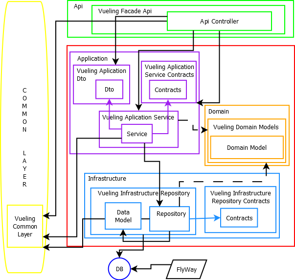

# VuelingApiDDD
Web Api con arquitectura DDD: Creamos una web api que gestiona una base de datos, haciendo las funciones CRUD.

La base de datos la versionamos con FlyWay.

Las extenciones y recursos necesarios los obtenemos con chocolatey.

## Extenciones y Nugets necesarios
Para este proyecto hace falta instalar la extension specflow y los nugets: EntityFramework, AutoMapper.

## Diagrama de la arquitectura

